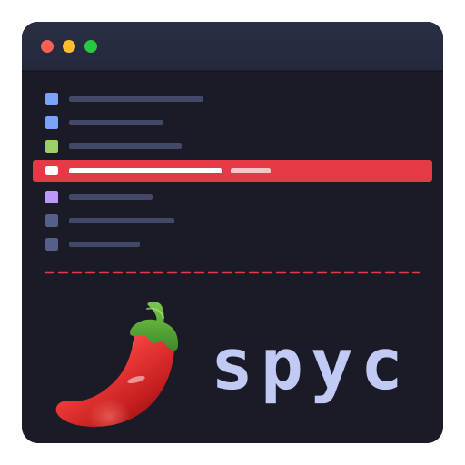
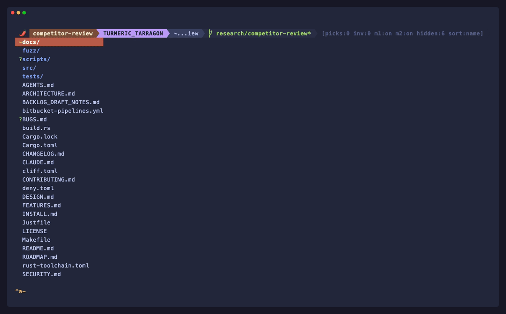

<p align="center">
  
</p>

<h1 align="center">spyc</h1>

<p align="center">
  The file commander is the noun the agent operates on.
</p>

<p align="center">
  Keyboard-driven · MCP-native · Rust · macOS and Linux
</p>

<p align="center">
  
</p>

---

## Why spyc?

Put an AI coding agent in your terminal and you usually get a chat
window — you still describe your working tree to it, paste paths back
and forth, and lose track of what it's looking at. spyc runs the agent
in a pane beside a keyboard-driven file commander, on macOS and Linux,
and gives it live, structured access to exactly what you're looking at
via a local MCP socket.

The agent can ask spyc *what is the cursor on, what is staged, what is
pinned, what is in this directory* — no copy-paste, no path description.
Pick three files and ask a question; the agent sees your selection. When
it mentions a path in its response, press `gf` to jump there. Context
flows both ways.

The file commander is the noun the agent operates on, not the chrome
around it.

## What it is

A two-pane terminal program.

- The **top pane** is a keyboard-driven, vim-flavoured file commander
  with git-aware listings.
- The **bottom pane** is a child process — by default Claude Code or
  codex (both first-class; Gemini, Antigravity, and zot also supported),
  but in practice any program.

The two panes share focus through a chord-prefix system (`^a` /
screen-style), and the file commander exposes a local Unix-domain
MCP socket the bottom-pane agent connects to.

> **Heads up for shell users:** spyc reserves `^a` and `^w` as
> chord prefixes, so a shell running inside the pane won't see
> them — `^a` (readline `beginning-of-line`) and `^w` (readline
> `unix-word-rubout`) are intercepted by spyc. If you run an
> interactive shell as your pane child, rebind the prefixes in
> `.spycrc.toml` (`spyc --print-config` shows the relevant
> section). The same applies inside tmux: `^a` is screen's prefix
> and `^b` is tmux's default — keep them distinct or `set -s
> escape-time 0` in `.tmux.conf` to keep input snappy. When you pick three
files and ask the agent a question, it can call `get_spyc_context`
and see your cwd, cursor file, picks, inventory, active filter, and
git branch — no copy-paste. When the agent mentions a path in its
response, press `gf` to jump straight to it. Context flows both ways.

Everything else — vi motions, marks, picks, inventory, pager, shell
integration — is what you'd expect from a keyboard-driven file
manager. The MCP bridge is the part that distinguishes spyc from
Yazi, Broot, Ranger, or the rest of the space.

The name: **spy** (inspired by SideFX's in-house file manager) +
**c**laude = **spyc**.

## Quick start

### Prerequisites

- **Rust** 1.88+ -- `curl --proto '=https' --tlsv1.2 -sSf https://sh.rustup.rs | sh`
- **Nerd Font** recommended for the powerline status bar; press `C`
  inside spyc to toggle a mono fallback if you don't have one.
  Install one with: `brew install --cask font-meslo-lg-nerd-font`
- **Claude Code** (optional) -- `npm install -g @anthropic-ai/claude-code`
- **Linux clipboard helper** -- yank-to-clipboard (`yf`, `yp`, `yP`,
  `ya`, pager yanks) needs `wl-copy` (Wayland) or `xclip` / `xsel`
  (X11). macOS uses the built-in `pbcopy`. See
  [INSTALL.md](INSTALL.md#clipboard-helper-linux-only) for details.

### Install

```sh
git clone https://bitbucket.org/tripstack/spyc.git
cd spyc
make install          # builds release + copies to ~/.local/bin (no sudo)
```

### Launch

```sh
spyc            # opens in the current directory
spyc -r         # resume a previous session (restores each pane to its own
                # Claude / Codex / Gemini / Antigravity / zot conversation, identified per-tab)
```

spyc opens with your cwd in a multi-column listing. Move with `hjkl`,
enter a directory or view a file in the pager with `Enter`, open
in `$EDITOR` with `e`. Press `?` for the full help overlay.

To open the Claude pane, press **`^\`** (Ctrl+Backslash) or **F10**.
Press **`^a j`** / **`^a k`** to switch focus between file list and pane.

## How the MCP bridge works

When spyc starts, it automatically:

1. **Starts an MCP server** on a PID-scoped Unix domain socket
   (`~/.local/state/spyc/mcp-<PID>.sock`)
2. **Writes `.mcp.json`** so Claude Code discovers spyc via standard
   config -- no flags needed
3. **Keeps a context snapshot current** -- cwd, cursor file, picks,
   inventory, filter, git branch -- updated as you navigate

Multiple instances coexist safely. If a new spyc opens in a directory
already owned by a live spyc, it prompts on stderr (`PID N already owns
MCP here. Take over? [Y/n]`) before sending the disconnect and
rewriting `.mcp.json`. Decline and the old instance keeps ownership.
Enterprise `managed-mcp.json` and `managed-settings.json` policies are
respected — see [INSTALL.md](INSTALL.md#enterprise-managed-environments)
for details.

Claude can call `get_spyc_context` at any time to see exactly what
you're looking at. Use `gf`/`gF` to jump from Claude's output back to
the file list. The context is bidirectional and always current.

Search MCP tools (`search_paths`, `search_content`, `search_picks`,
`search_inventory`) let Claude run gitignore-aware fuzzy filename
and regex content searches over the project, the user's currently-
picked files, or the persistent yanked-file cache — the last two
are state Claude can't see through generic filesystem tools.

Sessions are auto-saved on quit. `spyc -r` opens a session picker that
restores all pane tabs and resumes each agent's conversation. Claude
tabs spawn a fresh `claude` and type `/resume <sessionId>` into it once
it settles, verifying the submit landed and re-sending Enter if Claude's
async startup ate it (the `--resume` CLI flag has a mount-crash
regression).

## Keybindings

### Navigation

| Key | Action |
|-----|--------|
| `h` `j` `k` `l` | Move (counts work: `5j`, `10k`) |
| `gg` / `G` | Top / bottom |
| `Enter` | Descend into dir or view file in pager |
| `e` / `v` | Descend into dir or open file in `$EDITOR` |
| `dd` / `Ndd` | Remove cursor entry (+ N-1 below) to the graveyard (confirm with `y`) |
| `V` | Open `$EDITOR` in top pane (bottom pane stays visible) |
| `D` | Open file in the in-app pager in top pane (bottom pane stays visible) |
| `u` / `-` | Climb to parent |
| `/` | Search current listing (incremental, glob-aware) |
| `~` / `Home` | Jump to home (`H` is the harpoon prefix) |
| `J` | Jump to any path |
| `F` | Project-wide fuzzy filename finder (gitignore-aware) |
| `:grep <pat>` | Project-wide content search (embedded ripgrep matcher) |

### Picks & inventory

**Picks** are per-directory multi-select. **Inventory** is a persistent
file cache that survives across sessions.

| Key | Action |
|-----|--------|
| `t` | Toggle pick |
| `T` | Pick by glob |
| `yy` | Yank to inventory (copies file to cache) |
| `yp` | Yank visible pane output to clipboard |
| `yP` | Yank last typed prompt to clipboard |
| `Y` | Remove cursor file from inventory |
| `p` | Put inventory files into cwd |
| `i` | Toggle inventory view |

> Yank-to-clipboard uses `pbcopy` on macOS and `wl-copy` / `xclip` /
> `xsel` on Linux (auto-detected). Install one of those on Linux —
> see [INSTALL.md](INSTALL.md#clipboard-helper-linux-only).

### Graveyard (R-undo + soft-delete recovery)

Files removed with **`R`** (and items expelled from inventory) go
to a per-user **graveyard** as compressed `tar.zst` blobs (mode
bits + mtime preserved). Recover with `gy` or `:undo`. When the
graveyard exceeds 500 MB the oldest entries cascade to the system
trash so OS-native recovery still works.

| Key | Action |
|-----|--------|
| `gy` | Open graveyard view (newest first) |
| `:undo` | Restore most-recent removal to its original path |
| `p` (in view) | Restore cursor entry to cwd |
| `P` (in view) | Restore cursor entry to original path |
| `dd` / `x` (in view) | Purge cursor entry to system trash |
| `Z` (in view) | Purge ALL entries to system trash (confirm) |

### Git views

In-house gix-backed diff / show / blame pager views (in-process, no
`git` subprocess) — syntax-highlighted, side-by-side or unified (`|`
toggles), word-level intra-line change highlighting.

| Key | Action |
|-----|--------|
| `gd` | Diff vs HEAD for the selection (staged + unstaged + new) |
| `gD` | Staged-only diff (`git diff --cached`) |
| `gu` | Unstaged diff (`git diff`) — what changed since you staged |
| `gb` | Blame the cursor file |
| `\|` (in view) | Toggle side-by-side ⇄ unified layout |

### Split pane

The pane is a real pty -- it runs `claude` by default, but any command
works. Prefix is `^a` (screen-style); `^w` also works.

| Key | Action |
|-----|--------|
| `^\` / `F10` | Toggle pane |
| `F9` | Open pane with `claude --resume` |
| `^a j` / `^a k` | Switch focus |
| `^a c` | New tab |
| `^a n` / `^a ]` | Next tab |
| `^a p` / `^a [` | Prev tab |
| `^a K` / `^a x` | Close tab |
| `^a 1`..`9` | Switch to tab N |
| `^a s` | Send selection paths to pane |
| `^a P` | Pipe file contents to pane |
| `^a z` | Zoom the active region — list or bottom pane (fullscreen toggle) |
| `^a \|` | Vertical split — cycle off / top-only / full-height (live-reloading preview of the cursor file) |
| `^a a` / `^a h` | Focus the left file pane (a) |
| `^a b` / `^a l` | Focus the right file pane (b) |
| `^a d` | Toggle dimming of the inactive split column / list |
| `^s n` | Open a second file-commander (column b, at PROJECT_HOME) |
| `^s x` / `^d` | Close the second file-commander (`^d` quits if none open) |
| `^a u` | Quick Select — labeled picker for URL/path/SHA/IP |
| `^a v` | Pane scrollback in the in-app pager (search, jump, visual yank) |
| `Ctrl+J` | Newline in pane (multi-line input) |
| `gf` | Jump to file path in pane output |
| `gF` | Jump to file + open at referenced line |

### Pager

Press `Enter` on a file to view it in the built-in pager with
syntax highlighting, search, line numbers, hex dump, markdown
rendering, and ANSI color support. Press `?` inside the pager for
its own help overlay.

The pager is more than a centered overlay — it can also mount
in-place:

- **`D`** opens the cursor file in the **top pane** (bottom pane
  stays visible alongside).
- **`^a v`** mounts a frozen snapshot of pane scrollback in the
  **bottom pane**.

Inside the pager: `/` search with `n`/`N`, `:N` jump-to-line,
`V` enters visual line mode (`y` yanks the line range), `^v`
enters visual block mode for rectangular selection.

### Shell

| Key | Action |
|-----|--------|
| `!` | Captured command -- streams into pager |
| `!!` | Repeat last command |
| `!?` | History editor (vi-editable, searchable) |
| `;` | Foreground command (top, vim, etc.) |
| `$` | Drop into `$SHELL` |
| `:` | Command line (`:cd`, `:sort`, `:limit`, `:grep`, `:fg`, `:task`, `:q`) |

`%` in any command expands to the current selection.

### Background tasks & buffer history

Long captured commands shouldn't lock you out of spyc.

| Key | Action |
|-----|--------|
| `^Z` | (in `!` pager) send the running task to the background |
| `:fg` / `:fg N` | resume the most-recent (or specific) backgrounded task |
| `gB` / `:task N` | open the *task viewer* -- a peek view without taking ownership |
| `[t` / `]t` | (in pager, chord) cycle the task viewer prev/next by id |
| `gp` | reopen the most-recently-closed pager buffer |
| `:bprev` / `:bnext` | walk pager buffer history back/forward |
| `[b` / `]b` | (in pager, chord) walk buffer history back/forward |

Backgrounded tasks render in the pane divider as `[N+]` (running, new
output), `[N●]` (running, quiescent), `[N✓]` (exit 0), `[N✗]`
(non-zero / killed / crashed), in a distinct color from pane tabs.
When a viewed task exits, closing the task viewer pushes its
final rendered view into the buffer-history stack so `[b` walks
back to it later.

### Marks & filters

| Key | Action |
|-----|--------|
| `m{a-z}` | Set a bookmark |
| `'{a-z}` | Jump to bookmark |
| `''` | Jump back (like `cd -`) |
| `` ` `` | Jump to start dir (set with `gS` or `:startdir`) |
| `a` | Toggle dotfile filter |
| `o` | Toggle build artifact filter |
| `=` | Temporary glob filter (`=*.rs`, `=!` picks, `=git` git, `=h` harpoon) |

### Harpoon (per-worktree pinned files)

A small ordered list (max 9 slots) of files / dirs you're cycling
between. Persists per worktree (the focused column's repo root,
else `PROJECT_HOME`), so a second column in another worktree keeps
its own list.

| Key | Action |
|-----|--------|
| `Ha` | Append cursor file/dir to harpoon |
| `Hx` | Remove cursor file/dir from harpoon |
| `H1`..`H9` | Jump to slot N (chdir + place cursor) |
| `Hh` | Open harpoon menu (j/k, K/J reorder, dd delete) |
| `=h` | Limit listing to harpoon entries (incl. ancestor dirs) |

### Project home & session

Each spyc run has a `PROJECT_HOME` (a sticky project root) and a
session name (a spice-themed label like `SAFFRON_CUMIN`). Both appear
on the top bar and persist across `spyc -r`.

| Key | Action |
|-----|--------|
| `gh` | Jump to `PROJECT_HOME` |
| `gP` | Set `PROJECT_HOME` to current directory |
| `gS` | Set start dir (target of `` ` ``) to current directory |
| `gU` | Flash `user@host` in the status line |
| `:project [.\|<path>\|clear]` | Manage `PROJECT_HOME` |
| `:startdir [.\|<path>]` | Manage start dir |
| `:name <NEW>` | Rename the active session |
| `:whoami` | Show `user@host` |

`PROJECT_HOME` is auto-set on startup if the launch directory contains
`.git`. New pane tabs default their cwd to `PROJECT_HOME` when set.

## Configuration

spyc reads `.spycrc.toml` from `~/.spycrc.toml` (user) and `./.spycrc.toml`
(project). Changes are picked up live -- no restart needed (`^R` to force).

> **Project configs are sandboxed.** A `./.spycrc.toml` can set colors,
> layout, ignore masks, and rebind keys to built-in actions, but its
> *executing* bindings (`unix` shell commands and `jump`) are ignored --
> only your `~/.spycrc.toml` may bind those, so opening spyc in a cloned
> repo can't run commands a malicious `.spycrc.toml` planted there. `^R`
> reloads the project file from the directory you launched in, not the one
> you've browsed to.

To bootstrap a config with every option commented out at its default:

```sh
spyc --print-config > ~/.spycrc.toml
```

Selected options:

```toml
# Layout: where the status bar lives. "top" (default) or "bottom".
# Use "bottom" inside tmux so spyc's bar doesn't double up with tmux's.
[layout]
status_position = "bottom"

# Keymap: rebind keys to any action. Chord bindings supported.
keymap = [
    "map f unix file %",
    "map gh jump ~",
]

# Color overrides: customize the palette.
[colors]
cursor_bg = "#ff6600"
pick      = "#ffcb6b"
```

## Recommended setup

- **Terminal:** [iTerm2](https://iterm2.com/) (macOS), WezTerm, Kitty, Ghostty, or Alacritty
- **Font:** Any [Nerd Font](https://www.nerdfonts.com/) for the powerline status bar.
  Press `C` to toggle mono mode if you prefer not to install one.
- **Claude Code:** `npm install -g @anthropic-ai/claude-code`
- **Platforms:** macOS and Linux (x86_64, aarch64). Windows via WSL.

See [INSTALL.md](INSTALL.md) for detailed setup instructions.

## More docs

- [FEATURES.md](FEATURES.md) -- complete feature reference
- [INSTALL.md](INSTALL.md) -- terminal, font, build, and cross-compilation setup
- [ARCHITECTURE.md](ARCHITECTURE.md) -- concurrency model, MVU target shape, persistence, MCP transport
- [DESIGN.md](DESIGN.md) -- UI design language: components, surfaces, palette, extension checklist
- [CHANGELOG.md](CHANGELOG.md) -- release history
- [ROADMAP.md](ROADMAP.md) -- what's next
- [CONTRIBUTING.md](CONTRIBUTING.md) -- contribution guidelines and SemVer policy
- [BACKLOG_DRAFT_NOTES.md](BACKLOG_DRAFT_NOTES.md) -- owner's raw backlog / draft notes (bugs, ideas, reports)

## License

BSD-3-Clause. Logo uses [Twemoji](https://github.com/jdecked/twemoji) pepper
artwork (CC-BY 4.0).
