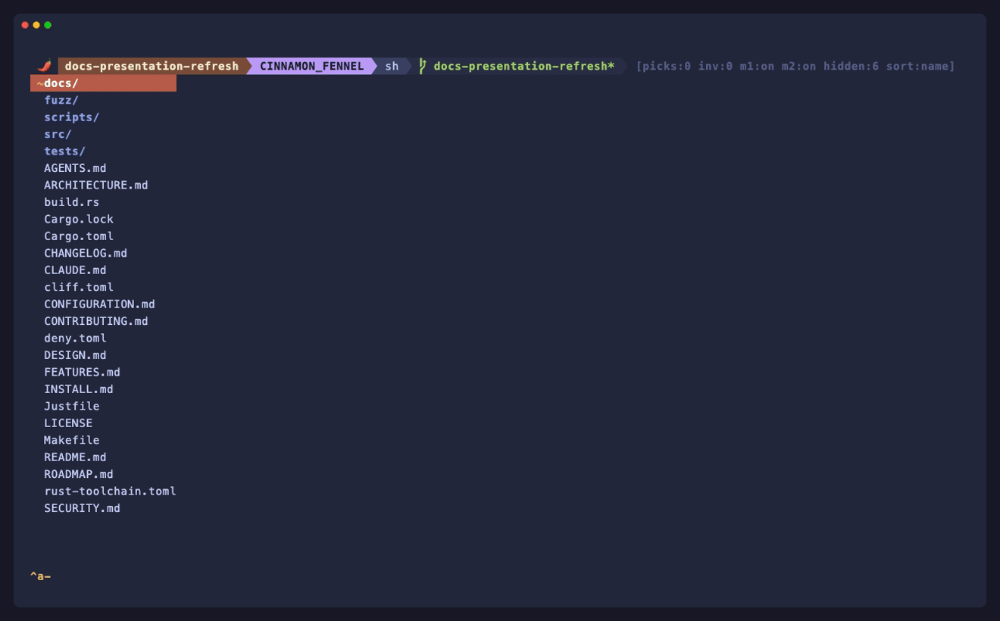

<p align="center">
  
</p>

<h1 align="center">spyc</h1>

<p align="center">
  The file commander built for collaborating with your coding agents.
</p>

<p align="center">
  Keyboard-driven · MCP-native · Rust · macOS and Linux
</p>

<p align="center">
  <a href="https://github.com/Tripstack-Corp/spyc/actions/workflows/ci.yml"></a>
  <a href="https://github.com/Tripstack-Corp/spyc/actions/workflows/audit.yml"></a>
  <a href="LICENSE"></a>
  
</p>

<p align="center">
  
</p>

---

## Why spyc?

Put an AI coding agent in your terminal and you usually get a chat
window. You still describe your working tree to it, paste paths back
and forth, and lose track of what it's looking at. spyc runs the agent
in a pane beside a keyboard-driven file commander, on macOS and Linux,
and gives it live, structured access to exactly what you're looking at
via a local MCP socket.

The agent can ask spyc *what is the cursor on, what is staged, what is
pinned, what is in this directory* — no copy-paste, no path description.
Pick three files and ask a question; the agent sees your selection. When
it mentions a path in its response, press `gf` to jump straight there.

The file manager is the shared workspace where you and your agents actually
work — not a file list bolted onto a chat window.

## What it is

A two-pane terminal program:

- The **top pane** is a keyboard-driven, vim-flavoured file commander with
  git-aware listings.
- The **bottom pane** is a child process — Claude Code by default (Codex,
  Gemini, Antigravity, and zot are first-class too), but in practice any
  program.

The panes share focus through a screen-style `^a` chord prefix, and the
commander exposes a local MCP socket the agent connects to. Everything else
(vi motions, marks, picks, inventory, pager, shell integration) is what you'd
expect from a keyboard-driven file manager — the MCP bridge is what sets spyc
apart from Yazi, Broot, or Ranger.

**The name.** Say it *"spy-see"* — near enough to *spicy*, which is where the
chili comes from. It carries a lineage too: `spy` and the keyboard-driven file
commanders that came before it, rebuilt from scratch in Rust for the age of
coding agents.

<sub>spyc is an independent project, not affiliated with or endorsed by Side Effects Software Inc. or Anthropic.</sub>

## Quick start

### Prerequisites

- **A coding agent** — Claude Code is the default
  (`npm install -g @anthropic-ai/claude-code`); Codex, Gemini, and Antigravity
  also work. spyc runs as a plain file manager without one, but the agent
  bridge is the whole point.
- **Nerd Font** (recommended) for the powerline status bar; press `C` inside
  spyc for a mono fallback. Install: `brew install --cask font-meslo-lg-nerd-font`
- **Linux clipboard helper** — yank needs `wl-copy` (Wayland) or `xclip` /
  `xsel` (X11); macOS uses the built-in `pbcopy`. See
  [INSTALL.md](INSTALL.md#clipboard-helper-linux-only).
- **Rust** 1.88+ — only if you build from source (see [BUILD.md](BUILD.md)).

### Install

Pre-built, signed binaries — no Rust toolchain needed:

```sh
# macOS & Linux — Homebrew
brew install Tripstack-Corp/tap/spyc

# Debian / Ubuntu — apt (signed repo)
sudo install -d -m 0755 /etc/apt/keyrings
curl -fsSL https://tripstack-corp.github.io/spyc/KEY.gpg | sudo tee /etc/apt/keyrings/spyc.asc >/dev/null
echo "deb [signed-by=/etc/apt/keyrings/spyc.asc] https://tripstack-corp.github.io/spyc ./" | sudo tee /etc/apt/sources.list.d/spyc.list >/dev/null
sudo apt update && sudo apt install spyc
```

Or grab a tarball from
[Releases](https://github.com/Tripstack-Corp/spyc/releases). To **build
from source** instead, see [BUILD.md](BUILD.md). Full setup — terminal,
font, clipboard, MCP, and verification — is in [INSTALL.md](INSTALL.md).

### Launch

```sh
spyc            # opens in the current directory
spyc -r         # resume a previous session (tabs + each agent's conversation)
```

Move with `hjkl`, `Enter` to open a file/dir, `e` for `$EDITOR`, `?` for the
full help overlay.

### Your first 5 minutes

The whole point is the agent in the side pane seeing exactly what you see.
Try it in a git repo:

1. Run `spyc`.
2. Press `t` on two or three files to **pick** them.
3. Press `^\` (Ctrl+Backslash) to open the agent pane — it launches `claude`
   by default (install it first; see Prerequisites).
4. Ask: **"How do these files interact?"** The agent reads your picks over
   MCP — no pasting paths.
5. When it names a file in its answer, press `gf` to jump straight to it.

`^a j` / `^a k` switch focus between the list and the pane.

## The MCP bridge

This is what sets spyc apart. On startup it runs a local MCP server and writes
the agent's config automatically — no flags, no setup. The agent can then ask
spyc, at any point:

- **What you're looking at** — `get_spyc_context`: cwd, cursor file, picks,
  inventory, active filter, git branch.
- **Where things are** — `search_paths` / `search_content` (gitignore-aware),
  plus `search_picks` and `search_inventory` for state generic filesystem tools
  can't see.

Press `gf` / `gF` to jump from the agent's output back to a file (and line).
Multiple instances coexist safely, and enterprise `managed-mcp.json` policies
are respected — details in [INSTALL.md](INSTALL.md#mcp-configuration).

## Running multiple agents

Run agents across several tabs and two problems show up; spyc handles both.

- **Which one needs me?** Each tab carries a live **activity dot** — a hot
  pulse while the agent works, a settled square when it's **blocked** (waiting
  on you) or **done**. The agent reports its own state over MCP, so it's right
  even while it redraws its UI. A transition into blocked/done fires a desktop
  notification naming the tab plus a brief border flash, so the nudge reaches
  you in another window. Tunable under `[notify]`.
- **Two agents, same files?** An advisory **scope registry** lets agents
  declare what they're editing or merging (`register_scope` / `list_scopes` /
  `wait_for_scope_clear`) so parallel agents stay out of each other's way — no
  daemon, in-memory, persisted across `-r`.

Sessions auto-save (and re-save seconds after any change, so a crash loses
almost nothing); `spyc -r` restores every tab and resumes each agent's
conversation. Full design:
[`docs/AGENT_ORCHESTRATION.md`](docs/AGENT_ORCHESTRATION.md).

## Keybindings

The essentials below. Press `?` in spyc for the full overlay, or see
[docs/KEYBINDINGS.md](docs/KEYBINDINGS.md) for the complete map.

| Key | Action |
|-----|--------|
| `h` `j` `k` `l` | Move (counts work: `5j`) |
| `Enter` / `e` | Open in pager / open in `$EDITOR` |
| `t` | Pick / unpick a file (multi-select) |
| `^\` or `F10` | Toggle the agent pane |
| `^a j` / `^a k` | Switch focus between list and pane |
| `^a s` | Send picked paths to the pane |
| `gf` / `gF` | Jump from pane output to a file (+ line) |
| `F` / `:grep` | Fuzzy filename finder / project content search |
| `?` | Full help overlay |
| `q` | Quit |

## Configuration

spyc reads `.spycrc.toml` from `~/.spycrc.toml` (user) and `./.spycrc.toml`
(project); changes apply live (`^R` to force). Bootstrap a fully-commented
config with every default:

```sh
spyc --print-config > ~/.spycrc.toml
```

You can rebind keys, set colors and layout, tune agent notifications, and
script with Lua. Full reference: [`CONFIGURATION.md`](CONFIGURATION.md).

> **Shell users — `^a` and `^w` are reserved.** spyc intercepts them as chord
> prefixes, so a shell (or tmux) running inside the pane won't see readline's
> `beginning-of-line` / `unix-word-rubout`. If you run an interactive shell as
> the pane child, rebind the prefixes in `.spycrc.toml`; inside tmux, keep
> spyc's `^a` distinct from tmux's prefix (or `set -s escape-time 0` for snappy
> input).

> **Project configs are sandboxed.** A `./.spycrc.toml` can set colors, layout,
> ignore masks, and rebind keys to built-in actions — but its *executing*
> bindings (`unix` shell commands, `lua` scripts, `jump`) are ignored; only your
> `~/.spycrc.toml` may bind those. So opening spyc in a cloned repo can't run
> commands a malicious `.spycrc.toml` planted there.

## Recommended setup

- **Terminal:** [iTerm2](https://iterm2.com/) (macOS), WezTerm, Kitty, Ghostty, or Alacritty
- **Font:** Any [Nerd Font](https://www.nerdfonts.com/) for the powerline status bar.
  Press `C` to toggle mono mode if you prefer not to install one.
- **Claude Code:** `npm install -g @anthropic-ai/claude-code`
- **Platforms:** macOS and Linux (x86_64, aarch64). Windows via WSL.

See [INSTALL.md](INSTALL.md) for detailed setup instructions.

## More docs

- [FEATURES.md](FEATURES.md) -- complete feature reference
- [docs/KEYBINDINGS.md](docs/KEYBINDINGS.md) -- the full keymap (the `?` overlay in browsable form)
- [CONFIGURATION.md](CONFIGURATION.md) -- config reference: `.spycrc.toml`, notifications, keymap DSL, Lua
- [INSTALL.md](INSTALL.md) -- install (Homebrew, apt, binary), terminal, font, clipboard, and MCP setup
- [BUILD.md](BUILD.md) -- build from source: Rust toolchain, `make install`, cross-compilation
- [ARCHITECTURE.md](ARCHITECTURE.md) -- concurrency model, MVU target shape, persistence, MCP transport
- [docs/AGENT_ORCHESTRATION.md](docs/AGENT_ORCHESTRATION.md) -- how the activity dots, notifications, session-resume, and scope registry fit together
- [DESIGN.md](DESIGN.md) -- UI design language: components, surfaces, palette, extension checklist
- [CHANGELOG.md](CHANGELOG.md) -- release history
- [ROADMAP.md](ROADMAP.md) -- strategy, direction, and the decisions log
- [CONTRIBUTING.md](CONTRIBUTING.md) -- contribution guidelines and SemVer policy
- [Issues](https://github.com/Tripstack-Corp/spyc/issues) -- the live backlog: bugs, features, and ideas (labeled, on the [roadmap board](https://github.com/orgs/Tripstack-Corp/projects/1))

## License

BSD-3-Clause. Logo uses [Twemoji](https://github.com/jdecked/twemoji) pepper
artwork (CC-BY 4.0).
