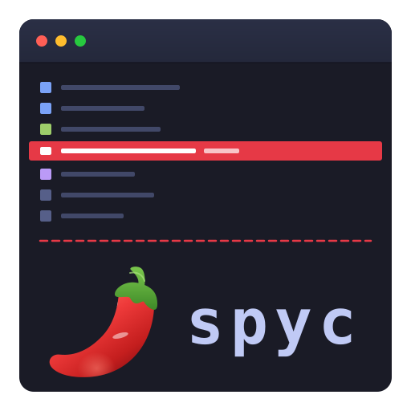
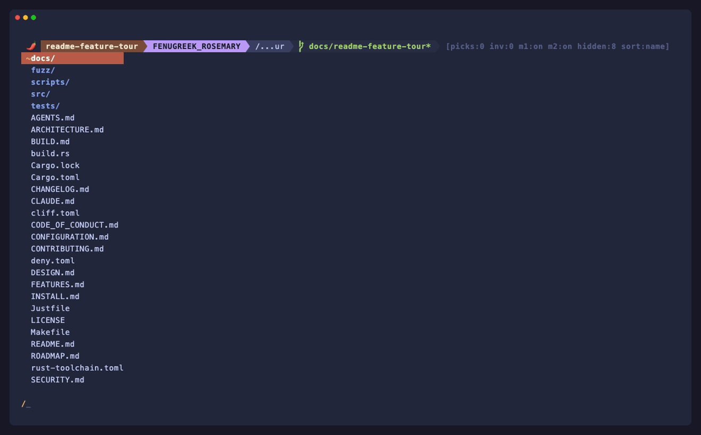
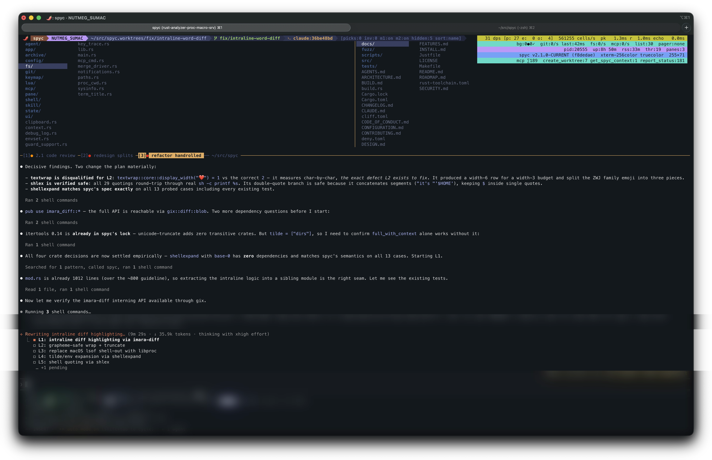
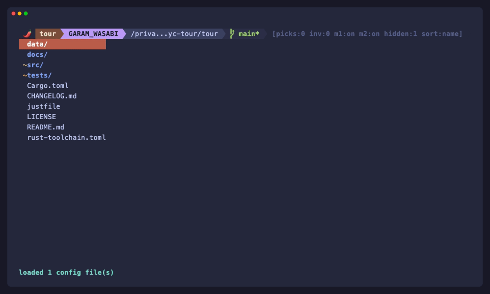
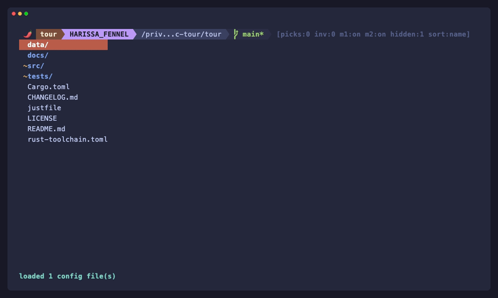
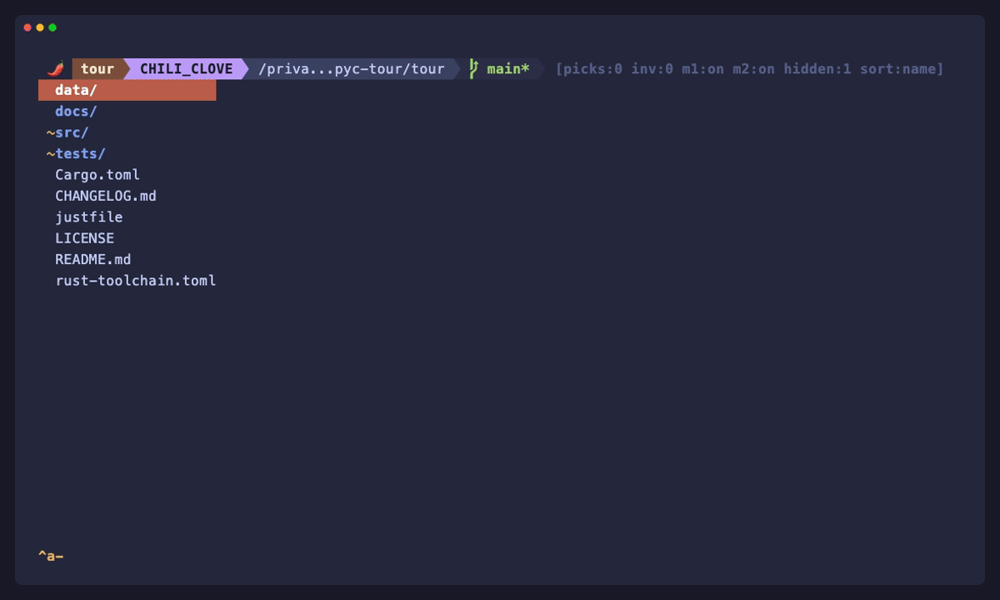

<p align="center">
  
</p>

<h1 align="center">spyc</h1>

<p align="center">
  The file commander built for collaborating with your coding agents.
</p>

<p align="center">
  Keyboard-driven · MCP-native · Rust · macOS and Linux
</p>

<p align="center">
  <a href="https://github.com/Tripstack-Corp/spyc/actions/workflows/ci.yml"></a>
  <a href="https://github.com/Tripstack-Corp/spyc/actions/workflows/audit.yml"></a>
  <a href="LICENSE"></a>
  
</p>

<p align="center">
  
</p>

---

## Why spyc?

Put an AI coding agent in your terminal and you get a chat window. You still
describe your working tree to it, paste paths back and forth, and lose track of
what it's looking at.

spyc runs the agent in a pane beside a keyboard-driven file commander and gives
it live, structured access to what you're looking at over a local MCP socket.
The agent asks spyc *what is the cursor on, what is staged, what is picked* —
no copy-paste, no path description. Pick three files, ask a question, and it
sees your selection. When it names a path in its answer, `gf` jumps you there.

Sharing a terminal with an agent usually means sharing a *screen* — cells and
scrollback for it to scrape. What spyc shares is the working set: cursor,
picks, filter, branch, worktree, as structured state it can query. The file
manager is the shared workspace where you and your agents actually work — not a
file list bolted onto a chat window.

## What it is

A two-pane terminal program. The **top pane** is a vim-flavoured file commander
with git-aware listings; the **bottom pane** is a child process — Claude Code by
default (Codex, Antigravity and zot are first-class too), in practice anything.
They share focus through a screen-style `^a` chord prefix.

Everything else — vi motions, marks, picks, inventory, pager, shell integration —
is what you'd expect from a keyboard-driven file manager. The MCP bridge is what
sets spyc apart from Yazi, Broot, or Ranger.



A real session, mid-task: two columns on one worktree (`^s n`), three agent tabs
on the divider each carrying its own activity dot, and the `A` monitor top-right
reporting draws per second, throughput, and every MCP tool the agents have
called. Two bands are blurred — the agent's own status line, and one command
echo carrying an absolute home path.

**The name.** Say it *"spy-see"* — near enough to *spicy*, which is where the
chili comes from. It carries a lineage too: `spy` and the keyboard-driven file
commanders before it, rebuilt from scratch in Rust for the age of coding agents.

<sub>spyc is an independent project, not affiliated with or endorsed by Side Effects Software Inc. or Anthropic.</sub>

## A tour

### Read anything, one key


Markdown renders, source arrives syntax-highlighted, a binary falls back to a
hex dump — same key every time, no editor, file list still there. Images open as
actual pictures on a terminal with a graphics protocol.

### Keep a file open beside the list



`^s |` opens a live preview column on the cursor file; press it on another file
to swap, again to close. It re-renders when the file changes on disk, so it
doubles as a watch window while something else writes.

### Review it where you are



The gutter marks what changed; `gd` diffs against HEAD, `|` toggles
side-by-side/unified, `gb` blames. All in-process through gix — spyc never
shells out to `git`.

### Script it in Lua


`map T lua todos` binds a key to a script. This one runs spyc's own
gitignore-aware search and picks every file with a TODO left in it. Scripts run
off the main thread behind a kill switch; `init.lua` can register `:` commands
and event hooks too.

### See which agent needs you



Each tab carries a live dot — pulsing while the agent works, settling to a
hot-red square the moment it blocks — and that transition fires a border pulse
and a desktop notification, so you get pulled back from another window. Driven
by the agent reporting its own status over MCP, not by scraping the screen.

## Install

Pre-built, signed binaries — no Rust toolchain needed:

```sh
brew install Tripstack-Corp/tap/spyc          # macOS & Linux
cargo install spyc                            # any platform, with Rust
```

Debian/Ubuntu users get a signed apt repo, and every release ships verified
tarballs. **Full install guide — apt, tarballs, terminal, font, clipboard and
MCP setup — is in [INSTALL.md](INSTALL.md);** building from source and running
the rolling CURRENT stream are in [BUILD.md](BUILD.md).

You'll want a coding agent for the pane (`npm install -g @anthropic-ai/claude-code`)
and a [Nerd Font](https://www.nerdfonts.com/) for the powerline status bar —
press `C` inside spyc for a mono fallback if you'd rather not install one.

## Your first 5 minutes

```sh
spyc            # opens in the current directory
spyc -r         # resume a session (tabs + each agent's conversation)
```

Move with `hjkl`, `Enter` opens, `e` edits, `?` shows the full help overlay.
Then try the part that makes spyc spyc, in a git repo:

1. Press `t` on two or three files to **pick** them.
2. Press `^\` to open the agent pane — it launches `claude` by default.
3. Ask: **"How do these files interact?"** The agent reads your picks over MCP,
   with no pasting of paths.
4. When it names a file, press `gf` to jump straight to it.

`^a j` / `^a k` switch focus between the list and the pane.

## The MCP bridge

On startup spyc runs a local MCP server and writes the agent's config
automatically — no flags, no setup. The agent can then ask spyc:

- **What you're looking at** — `get_spyc_context`: cwd, cursor file, picks,
  inventory, active filter, git branch.
- **Where things are** — `search_paths` / `search_content` (gitignore-aware),
  plus `search_picks` and `search_inventory` for state generic filesystem tools
  can't see.
- **Git and worktrees** — status, log and diff in-process, plus worktree
  create/open/remove without ever shelling out to `git worktree`.

The handshake has to stay short, so the depth ships as an installable skill:

```sh
spyc --install-skill      # → Claude Code, codex, and agy skill dirs
```

spyc offers a `[Y/n]` update when its copy moves ahead of yours, never
overwrites edits you've made, and is managed in-app with `:skill`. Multiple
spyc instances coexist, one owning MCP for a directory at a time, and
enterprise `managed-mcp.json` policies are respected — see
[INSTALL.md](INSTALL.md#mcp-configuration).

## Running multiple agents

Each tab's **activity dot** answers *which one needs me* — hot pulse while
working, settled square when blocked or done, with a desktop notification on the
transition. An advisory **scope registry** (`register_scope` / `list_scopes` /
`wait_for_scope_clear`) keeps parallel agents off each other's files. Sessions
auto-save within seconds of any change, so a crash loses almost nothing and
`spyc -r` resumes every tab and conversation. Design:
[docs/AGENT_ORCHESTRATION.md](docs/AGENT_ORCHESTRATION.md).

## Keybindings

The essentials. Press `?` in spyc for the full overlay, or see
[docs/KEYBINDINGS.md](docs/KEYBINDINGS.md) for the complete map.

| Key | Action |
|-----|--------|
| `h` `j` `k` `l` | Move (counts work: `5j`) |
| `Enter` / `e` | Open in pager / open in `$EDITOR` |
| `t` | Pick / unpick a file (multi-select) |
| `^\` or `F10` | Toggle the agent pane |
| `^a j` / `^a k` | Switch focus between list and pane |
| `^a s` | Send picked paths to the pane |
| `gf` / `gF` | Jump from pane output to a file (+ line) |
| `F` / `:grep` | Fuzzy filename finder / project content search |
| `?` / `q` | Full help overlay / quit |

## Configuration

spyc reads `.spycrc.toml` from `~/.spycrc.toml` (user) and `./.spycrc.toml`
(project), applying changes live. Bootstrap a fully-commented file with every
default:

```sh
spyc --print-config > ~/.spycrc.toml
```

Rebind keys, set colors and layout, tune agent notifications, script in Lua.
Note that `^a` and `^w` are reserved as chord prefixes, and a project-local
config can't bind executing verbs — full reference, including both rules, in
[CONFIGURATION.md](CONFIGURATION.md).

## More docs

| | |
|---|---|
| [FEATURES.md](FEATURES.md) | complete feature reference |
| [docs/KEYBINDINGS.md](docs/KEYBINDINGS.md) | the full keymap, browsable |
| [CONFIGURATION.md](CONFIGURATION.md) | `.spycrc.toml`, notifications, keymap DSL, Lua |
| [INSTALL.md](INSTALL.md) | install channels, terminal, font, clipboard, MCP setup |
| [BUILD.md](BUILD.md) | build from source, cross-compilation, the CURRENT stream |
| [docs/HARNESS.md](docs/HARNESS.md) | running agents in spyc: per-agent quirks and settings |
| [docs/AGENT_ORCHESTRATION.md](docs/AGENT_ORCHESTRATION.md) | activity dots, notifications, resume, scope registry |
| [ARCHITECTURE.md](ARCHITECTURE.md) | concurrency model, MVU shape, persistence, MCP transport |
| [DESIGN.md](DESIGN.md) | UI design language: components, surfaces, palette |
| [CHANGELOG.md](CHANGELOG.md) · [ROADMAP.md](ROADMAP.md) | release history · strategy and decisions log |
| [CONTRIBUTING.md](CONTRIBUTING.md) | contribution guidelines and SemVer policy |
| [Issues](https://github.com/Tripstack-Corp/spyc/issues) | the live backlog, on the [roadmap board](https://github.com/orgs/Tripstack-Corp/projects/1) |

## License

BSD-3-Clause. Logo uses [Twemoji](https://github.com/jdecked/twemoji) pepper
artwork (CC-BY 4.0).
