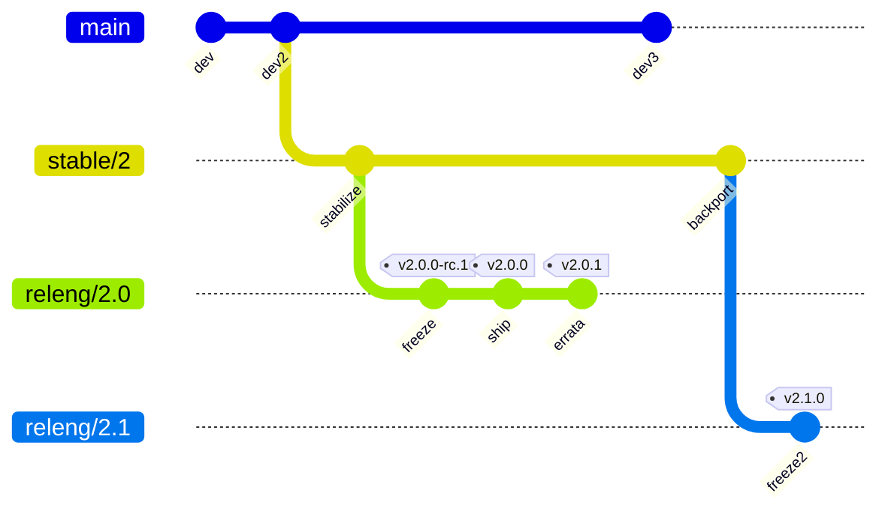

# spyc — Release Engineering & Public Launch

> Planning + living-process doc. The **process** half (streams, versioning,
> cadence, security) is public and carries to the repo; the **one-time
> deployment checklist** (§12) is setup scaffolding for the public 2.0 launch.
> Modeled on FreeBSD's release-engineering process, right-sized for a small team
> and phased in.

## 1. Philosophy

FreeBSD's release model is the gold standard for *predictable* software: a
rolling development head, conservative stabilization branches, frozen release
branches that only take vetted fixes, signed artifacts, and published support
windows. spyc adopts the **shape** of that model — the value is the
predictability, not the bureaucracy — and phases it in:

- **Stage 1 (launch):** `main` (CURRENT) + tagged RELEASEs cut through a short
  BETA/RC freeze, a single supported line, GitHub Security Advisories for
  vulns. Enough structure to be trustworthy; not so much it stalls a small team.
- **Stage 2 (maturity):** introduce `stable/N` + `releng/N.M` branches and
  backports once two major lines need parallel support. Don't pay for it before.

Principles: every released artifact is **reproducible** (pinned toolchain,
`--locked`) and **signed**; every release has **notes** (git-cliff +
human-written highlights); support windows are **published**; security has a
**single front door**.

## 2. Release streams (the FreeBSD model, mapped)

| FreeBSD | spyc | Git ref | Audience | Stability |
|---|---|---|---|---|
| `-CURRENT` | **CURRENT** | `main` | contributors, early adopters | rolling, may break |
| `-STABLE` | **STABLE** | `stable/N` (per major) | users wanting fixes without churn | ABI/behavior-stable within major N |
| `-RELEASE` | **RELEASE** | tag `vN.M.P` on `releng/N.M` | end users | frozen snapshot |
| `releng/*` | **release branch** | `releng/N.M` | release engineering | frozen; security/errata only |
| snapshots | **SNAPSHOT** | CI artifacts off `main`/`stable/N` | testers | nightly/weekly, unsigned-prerelease |

- **CURRENT (`main`)** — all development lands here, gated by CI. Nightly
  snapshot builds are published as a rolling `nightly` prerelease.
- **STABLE (`stable/N`)** — cut from `main` when major `N` begins its life.
  Receives only **backports** of vetted fixes (FreeBSD's *MFC — Merge From
  Current*); our equivalent is a cherry-pick PR labeled `backport stable/N`. No
  new features that break behavior within the major.
- **RELEASE (`releng/N.M`)** — a release branch forked from `stable/N` (or from
  `main` for the very first release), then **frozen**. It only ever receives
  errata + security patches, each producing a new patch tag `vN.M.P`.
- **SNAPSHOT** — automated builds for people who want to test ahead of a release.

**MFC / backport rule:** a fix flows *toward* stability — land on `main`, then a
labeled cherry-pick PR backports it to `stable/N`, then (if a release branch is
open) to `releng/N.M`. Never the reverse. During a freeze, backports to
`releng/*` require Release-Manager approval.

## 3. Versioning

SemVer, with FreeBSD's patch-level mapping made explicit:

- `MAJOR.MINOR.PATCH` — `MAJOR.MINOR` names the release branch (`releng/2.0`),
  `PATCH` is FreeBSD's `-pK` errata/security level (`v2.0.0` → `v2.0.1` → …).
- **Prereleases:** `vN.M.0-beta.1`, `vN.M.0-rc.1` — published as GitHub
  *pre-releases* (the "Latest" badge stays on the last stable).
- **Breaking changes** bump MAJOR and (Stage 2) start a new `stable/N`.
- **Reproducibility:** the pinned `rust-toolchain.toml` + `--locked` mean a tag
  rebuilds bit-stable across runners.

> **Launch number: `2.0.0`.** spyc keeps its name and its version line — the
> public launch is a deliberate major bump from the current `1.9x` development
> line, not a reset to `1.0.0`. (The `1.0.0`-reset option only existed under the
> abandoned clean-slate rebrand; staying spyc, we continue the line.)

## 4. Branch & tag topology

(`spyc`'s own pager renders this; so does GitHub.) Stage 1 collapses the middle:
tag RELEASEs directly off `main` until a second major needs `stable/`.

## 5. The release cycle

**Stage 1 (single line, what we launch with):**

1. Development accrues on `main`; CI green on every PR.
2. **Cut RC:** tag `vN.M.0-rc.1` on `main`. `release.yml` builds + publishes a
   GitHub *pre-release* with full artifacts. Soak (e.g., 3–7 days / dogfood).
3. Fix blockers on `main`; re-tag `-rc.2` as needed.
4. **Release:** `make release-tag VERSION=N.M.0` (bumps `Cargo.toml`, prepends
   the git-cliff changelog section, commits, tags `vN.M.0`). Push the tag →
   `release.yml` publishes the RELEASE.
5. **Patch:** for a post-release fix, `make release-tag VERSION=N.M.(P+1)` →
   tag → release. (Stage 2: cherry-pick onto `releng/N.M` first.)

**Stage 2 (parallel majors):** add a freeze on a `releng/N.M` branch forked
from `stable/N`, run `-beta.X` → `-rc.X` → `vN.M.0` on that branch, and keep
`main` open for the next major. The Release Manager owns the freeze window.

Each tag matching `v*` triggers `release.yml` (§8); `-beta`/`-rc` tags are
auto-marked pre-release by pattern.

## 6. Maintenance: Errata & Security (EN / SA)

FreeBSD splits post-release fixes into **Errata Notices** (critical non-security)
and **Security Advisories**. spyc's equivalents:

- **Security front door:** `SECURITY.md` (already in repo — add a *Supported
  Versions* table) pointing at **GitHub private vulnerability reporting**
  (Security tab → advisories). Triage → fix on `main` → backport to every
  supported `releng/*` → coordinated patch release `vN.M.(P+1)` → publish a
  **GHSA** with a CVE if warranted. Credit reporters.
- **Errata:** critical non-security regressions get the same backport-and-patch
  path, announced in the release notes under a dedicated "Errata" heading.
- **Signing:** release notes + `SHA256SUMS` are signed (§9) so an advisory's
  artifacts are verifiable.
- **Supply chain:** `audit.yml` runs `cargo deny check advisories` weekly (ported
  from the retired Bitbucket `weekly-deps` pipeline) so RUSTSEC advisories surface
  between releases; optionally Dependabot for the Actions themselves.

## 7. Support & EOL policy

Publish this table in the README/SECURITY.md and keep it current:

| Stream | Supported? | Window |
|---|---|---|
| Latest RELEASE (`vN.M.x`) | ✅ full (features land in next minor; fixes as patches) | until 2 minors newer ships |
| Previous minor (`vN.(M-1).x`) | ✅ security + errata only | 3 months after the newer minor |
| `stable/N` (current major) | ✅ (Stage 2) | life of major N |
| Older majors | ❌ EOL | — |
| `nightly` / RC | ⚠️ testing only | never "supported" |

Right-sized for launch: **support the latest RELEASE; security-patch the
previous minor for a short tail.** Expand windows as the user base grows.

## 8. CI/CD pipelines (GitHub Actions)

Five workflows under `.github/workflows/`. All pin the toolchain via
`rust-toolchain.toml` and run cargo with `--locked`. The local `make` targets
are the source of truth — Actions *call them* so local and CI never drift.

> **Dev-platform: RESOLVED (2026-07-02) — full move to GitHub.** All dev + CI run
> on GitHub Actions; `bitbucket-pipelines.yml` is retired (archived under
> `docs/archive/`). **`ci.yml`, `audit.yml`, and `release.yml` are implemented**
> (the last with keyless signing, no secrets). The **Homebrew tap is live** —
> `Tripstack-Corp/homebrew-tap` carries a `Formula/spyc.rb` that installs the
> signed release tarballs (macOS universal + Linux x86_64/aarch64) and supports
> `--HEAD` source builds. **`apt.yml` is implemented** — it builds `.deb`
> packages and publishes a signed apt repository to GitHub Pages (see below).
> `snapshot.yml` (nightly cadence) remains to build.

### `ci.yml` — quality gate (PR + push to `main`) — **IMPLEMENTED**
- Direct port of the retired `bitbucket-pipelines.yml`: `lint` (fmt + clippy +
  deny) ∥ `test` on PRs, plus a `coverage` job (`cargo llvm-cov --locked
  --all-targets --fail-under-lines 35`) on pushes to `main`. Toolchain cached via
  `Swatinem/rust-cache`; `cargo-deny` + `cargo-llvm-cov` are the same sha-pinned
  prebuilt binaries as before; `CARGO_INCREMENTAL=0` throughout. Make it a
  required status check in branch protection.
- **Follow-ups:** (1) add a `macos-latest` matrix leg to catch OS-gated lints
  both ways (replaces needing `make lint-linux` + zig locally) — the initial
  port is Linux-only, matching the retired pipeline; (2) extend the trigger to
  `stable/*` / `releng/*` once Stage 2 branches exist. Both are cheap once the
  Linux gate is confirmed green on GitHub.

### `release.yml` — build, sign, publish (on tag `v*`) — **IMPLEMENTED**
- **Trigger:** `push: tags: ['v*']`. Detect `-alpha`/`-beta`/`-rc` → mark GitHub
  Release as *pre-release*.
- **Build matrix** (calls the existing Makefile targets):
  - `macos-latest` → `make release-macos-universal` (arm64 + x86_64 lipo).
  - `ubuntu-latest` → `make release-linux-x86` + `release-linux-arm` (musl
    static via `cargo-zigbuild`, already wired).
- **Package:** `make dist` collects them into `dist/`; `make dist-checksums`
  emits `SHA256SUMS`.
- **Sign (§9):** GitHub artifact attestations (SLSA provenance, keyless OIDC) +
  sign `SHA256SUMS` (cosign keyless, and/or `make dist-sign` GPG with `GPG_KEY`
  secret).
- **Notes:** `make changelog` (git-cliff) for the generated section + a hand-
  written highlights block (the 1Password/Slack "changelog for humans" style the
  backlog calls for).
- **Publish:** create the GitHub Release, attach `spyc-vN.M.P-<target>.tar.gz` ×4,
  `SHA256SUMS`, signatures. Trigger `homebrew.yml`.
- **Permissions:** `contents: write`, `id-token: write` (attestations),
  `attestations: write`.
- **As built (deviations from the sketch above):** the `macos`/`linux` build
  jobs run per-runner and call the platform Makefile targets directly (rather
  than `make dist` / `make dist-checksums`, which build *all* platforms on one
  host); a final `publish` job downloads the artifacts, computes `SHA256SUMS`,
  and creates the release with `gh release create` (no third-party publish
  action). Three platform tarballs ship (macOS universal counts once). Signing
  is **keyless only** — build-provenance attestations + a cosign-signed
  `SHA256SUMS.cosign.bundle`; GPG (`make dist-sign`), the Homebrew tap, and the
  hand-written highlights block are fast-follows. Zig for the musl cross-links
  comes from `mlugg/setup-zig`; `cargo-zigbuild` + `git-cliff` from
  `taiki-e/install-action`.

### `snapshot.yml` — nightly CURRENT builds (schedule + manual)
- `schedule` (nightly) + `workflow_dispatch`. Build `main` with the release
  matrix, publish/refresh a single rolling `nightly` pre-release (delete-and-
  recreate, or a dated tag pruned to last N). Unsigned-acceptable; clearly
  labeled "testing only."

### `audit.yml` — supply-chain drift (schedule) — **IMPLEMENTED**
- Weekly `cargo deny check advisories` (fresh RUSTSEC DB) + `cargo outdated` +
  `cargo tree --duplicates` (Mon 06:00 UTC + manual dispatch). Ported from the
  retired Bitbucket `weekly-deps` pipeline. The old Bitbucket→Slack failure
  notification does *not* carry over — add a GitHub-issue/Slack step if wanted.

### `homebrew.yml` — tap bump (on release published) — **TAP LIVE**
- `Tripstack-Corp/homebrew-tap` is live with `Formula/spyc.rb` (pins the release
  version, its per-platform tarball URLs + SHA256s, and a `--HEAD` source build).
  On a non-prerelease publish this workflow recomputes the SHAs and pushes the
  formula bump. Needs a `HOMEBREW_TAP_TOKEN` secret (fine-grained PAT with
  `contents:write` on the tap repo).

### `apt.yml` — signed apt repo publish (on release published) — **LIVE**
- On a non-prerelease publish: download the release's Linux tarballs, build
  `.deb`s (`make deb`), regenerate the apt index (`apt-ftparchive`), sign the
  `Release` file with the signing key, and commit the tree to this repo's
  **`gh-pages`** branch — served via GitHub Pages at
  `https://tripstack-corp.github.io/spyc`, so users `apt install spyc` /
  `apt upgrade`. Because the apt repo lives on this repo's own branch, the push
  uses the built-in **`GITHUB_TOKEN`** (org-owned, `contents:write`) — no
  personal/cross-repo token. The job self-skips when the signing key is absent.
- **Signing key** — a dedicated RSA-4096 key signs `Release`; its public half is
  published as `KEY.gpg` (what users pin via `signed-by`). The private key +
  passphrase live in the **`apt-publish` protected Environment** (secrets
  `APT_GPG_PRIVATE_KEY` + `APT_GPG_PASSPHRASE`), scoped so only this job — on a
  `v*` tag or `main` — can read them.
- **Operator setup — DONE** (kept for reference / rebuild):
  1. `gh-pages` on `spyc` holds the apt tree; Pages serves it from `/` root.
  2. The `apt-publish` Environment (deployment policy: `v*` tag + `main` branch)
     holds the two `APT_GPG_*` secrets.
  3. The signing key is backed up off-repo (owner's password manager) with a
     revocation certificate.
- **Prerelease note:** publishing is gated to non-prerelease tags so package
  versions stay clean `X.Y.Z` (a `2.0.0~rc.4`-style `~` epoch would otherwise be
  needed for correct apt ordering).

**Cross-cutting:** `concurrency` groups to cancel superseded runs (already wired
in `ci.yml`); repo secrets = `GPG_KEY`/`GPG_PASSPHRASE` (if GPG signing) and
`HOMEBREW_TAP_TOKEN`; the `apt-publish` environment holds `APT_GPG_PRIVATE_KEY` +
`APT_GPG_PASSPHRASE`. The apt push uses the built-in `GITHUB_TOKEN` and cosign
uses OIDC — no other stored tokens.

## 9. Artifacts, signing & distribution

**Target matrix** (already supported by `rust-toolchain.toml` + Makefile):

| Platform | Target triple | Build | Artifact |
|---|---|---|---|
| macOS (Apple Silicon + Intel) | `aarch64`/`x86_64-apple-darwin` | universal lipo | `spyc-vN.M.P-macos-universal.tar.gz` |
| Linux x86_64 | `x86_64-unknown-linux-musl` | static | `spyc-vN.M.P-linux-x86_64.tar.gz` |
| Linux aarch64 | `aarch64-unknown-linux-musl` | static | `spyc-vN.M.P-linux-aarch64.tar.gz` |
| Windows | — | via WSL (use the Linux build) | documented, not a native target |

**Checksums:** `SHA256SUMS` (`make dist-checksums`).

**Signing — recommend layering:**
1. **GitHub artifact attestations** (SLSA build provenance, keyless via OIDC) —
   the modern default; verifiable with `gh attestation verify`. Zero key
   management.
2. **Signed `SHA256SUMS`** — cosign keyless (Rekor transparency log) and/or the
   existing `make dist-sign` GPG path (`GPG_KEY`) for users who want a Web-of-
   Trust signature. Document `cosign verify-blob` / `gpg --verify` in INSTALL.

**Distribution channels:**
- **GitHub Releases** — primary; the binaries + checksums + signatures live here.
- **Homebrew tap** — `brew install Tripstack-Corp/tap/spyc` (**live**; works on
  macOS and Linux/Linuxbrew). `homebrew.yml` keeps the formula current.
- **apt repository** — `apt install spyc` on Debian/Ubuntu from the signed
  GitHub-Pages repo (`apt.yml`; amd64 + arm64).
- **`cargo-binstall`** — add the `[package.metadata.binstall]` hints to
  `Cargo.toml` so `cargo binstall spyc` pulls the GitHub artifact (no compile).
- **crates.io** — optional `cargo install spyc` (§13.5); reserve the name
  regardless.

## 10. GitHub org & repo presentation (Tripstack-Corp)

Two brands coexist and must stay distinct: **spyc is the product** (its mark is
the chili 🌶️, per `BRAND.md`); **Tripstack is the maintainer/publisher** (its
logo lives at the org level and in a "maintained by" line — not as the product
mark).

**Org — `github.com/Tripstack-Corp`:**
- **Profile README** via a `Tripstack-Corp/.github` repo (`profile/README.md`) —
  who Tripstack is, what it ships, links. Carries the **Tripstack logo** + brand
  description.
- **Org avatar** = Tripstack logo; org description + verified domain if available.
- Pin `spyc` once public.

**Repo — `Tripstack-Corp/spyc`:**
- **About:** description = BRAND.md's crate line ("A keyboard-driven, MCP-native
  terminal file commander that gives your coding agent live eyes on your working
  tree."); homepage; **topics:** `rust` `tui` `cli` `terminal` `file-manager`
  `mcp` `ai-agents` `claude` `developer-tools`.
- **Social preview** (1280×640) — the spyc chili on Charcoal with the wordmark,
  palette from BRAND.md.
- **README** — spyc logo at top, badges (CI, latest release, license, platform),
  the positioning line, the install one-liners, a "Maintained by Tripstack"
  footer with the Tripstack logo.
- **Community health files:**
  - `LICENSE` — BSD-3 (final form pending legal, §13.2).
  - `SECURITY.md` — **exists**; add the Supported Versions table + GitHub
    private-reporting link.
  - `CONTRIBUTING.md` — exists; update + add the release/backport workflow.
  - `CODE_OF_CONDUCT.md` — **add** (none today; Contributor Covenant).
  - `.github/ISSUE_TEMPLATE/` (bug + feature) + `PULL_REQUEST_TEMPLATE.md`.
  - `CODEOWNERS` — route reviews to the maintainers.
  - `FUNDING.yml` — optional.
- **Branch protection:** `main` (require `ci.yml`, ≥1 review, linear history);
  `stable/*` + `releng/*` (same + **no force-push**, restrict who can push).
- **Repo settings:** enable Discussions (optional), private vulnerability
  reporting, secret scanning + push protection, Actions with the minimal
  permissions above; default to **squash-merge** (matches the existing
  one-commit-per-shape convention) with a clean title.

## 11. Roles

- **Release Manager (FreeBSD `re@`):** owns the cadence, declares freezes, cuts
  RCs/RELEASEs, approves backports to a frozen `releng/*`. Holds the release
  signing key (or the OIDC config).
- **Security Contact (FreeBSD `so@`):** monitors private vuln reports, drives
  fix + coordinated disclosure + GHSA. Can be the same person at launch; name a
  backup.
- Document both in `SECURITY.md` / `CONTRIBUTING.md` (a handle/alias, not a
  personal name per our conventions).

## 12. One-time launch checklist (public 2.0)

spyc keeps its name and git history — the public launch is publishing the
existing repo, not seeding a clean slate. Ordered to stand the whole thing up:

1. **Decide the public-repo topology (§13.4):** the private
   `Tripstack-Corp/spyc` is canonical — decide whether to flip it public with
   full history intact or curate/squash a seed first (Bitbucket is retired, not
   a fallback record). Then create the supporting repos — `Tripstack-Corp/.github`
   (org profile), `Tripstack-Corp/homebrew-tap`.
2. Set org avatar (Tripstack logo) + profile README + descriptions.
3. **Resolve the remaining launch gates (§13):** license final form +
   maintainer/IP sign-off (§13.1–2, both launch blockers). Dev/CI platform
   (§13.3) is resolved — full GitHub. The homage-line framing (§13.6) is already
   implemented in the README (nominative lineage + disclaimer); confirm and close.
4. Add the remaining workflows — `.github/workflows/{release,snapshot,homebrew}.yml`
   (`ci.yml` + `audit.yml` already exist).
5. Add/refresh community-health files (LICENSE, SECURITY.md Supported-Versions
   table, CONTRIBUTING, add CODE_OF_CONDUCT, issue/PR templates, CODEOWNERS).
6. Repo About: description, homepage, topics; upload the social-preview card.
7. Configure secrets (`GPG_KEY`/`GPG_PASSPHRASE` if GPG; `HOMEBREW_TAP_TOKEN`) +
   Actions permissions (`id-token: write` for attestations).
8. Branch protection on `main` (+ `stable/*`, `releng/*` for Stage 2); required
   checks; squash-merge default.
9. Enable Security: private vuln reporting, secret scanning, (optional)
   Dependabot for Actions.
10. **Dry run:** push a throwaway `v0.0.0-rc.1` tag → confirm `release.yml`
    builds all four artifacts, signs, and publishes a pre-release; verify with
    `gh attestation verify` + checksum.
11. Add `[package.metadata.binstall]` to `Cargo.toml`; publish the first Homebrew
    formula; (optional) reserve/publish crates.io.
12. Flip the repo public → cut `v2.0.0` (via the RC → RELEASE cycle, §5) →
    announce.

## 13. Open decisions

1. **License — public-release form:** confirm with legal what Tripstack can
   publish and under which license (currently **BSD-3-Clause** in `Cargo.toml` /
   `deny.toml`). Reconcile a *single* answer across `Cargo.toml` `license`, a
   root `LICENSE` file, `deny.toml`, and BRAND.md. **Launch blocker.**
2. **Maintainer / IP:** confirm Tripstack owns the work and signs off on a public
   OSS release under the company name. **Launch blocker.**
3. **CI / dev platform — RESOLVED (2026-07-02): full move to GitHub.** All dev +
   CI run on `github.com/Tripstack-Corp/spyc` (Actions + `gh`); the repo stays
   private until launch. `bitbucket-pipelines.yml` is retired (archived);
   `ci.yml` + `audit.yml` are ported and live in `.github/workflows/`. `bkt` →
   `gh`; PRs, branch protection, and required checks are GitHub-native.
4. **Public-repo topology:** flip the private, full-history `Tripstack-Corp/spyc`
   public with its history intact (transparent "built from scratch" trail) vs.
   curate/squash a seed first (drop internal planning/review docs + the owner's
   backlog from the public record). Bitbucket is retired, so it is no longer a
   provenance fallback. *(Recommend: carry history if nothing sensitive is in it;
   otherwise curate a seed.)*
5. **crates.io:** publish `spyc` (reserve the name now) or stay source/binary
   install only? *(Recommend: reserve now; publish fast-follow.)*
6. **Public homage-line framing:** the README's "spy + claude = spyc" origin
   reads, to a strict trademark eye, as an admission of derivation from SideFX's
   `spy` (risk assessed **Medium → Negligible**; no registered SideFX mark).
   Decide whether to keep it verbatim, soften to a plain nominative-fair-use
   lineage line (no hybrid-mark construction, add a "not affiliated with Side
   Effects Software or Anthropic" disclaimer), or omit the explicit derivation.
   *(Recommend: keep the spice/`spy-see` story, frame the lineage descriptively,
   add the disclaimer.)*
7. **Cadence:** feature-ready minors vs. time-based? *(Recommend: feature-ready
   at launch, revisit time-based once stable.)*
8. **Signing:** attestations only, + cosign, + GPG? *(Recommend: attestations +
   cosign-signed checksums; GPG optional.)*
9. **Install channels at launch:** Releases + Homebrew + binstall; add `curl|sh`?
   *(Recommend: Releases + Homebrew + binstall for v2.0; script + crates.io
   fast-follow.)*
10. **Native Windows** ever, or WSL-only? *(Recommend: WSL-only; revisit on
    demand.)*
11. **Nightly snapshots** from day one or after launch? *(Recommend: after
    launch.)*
