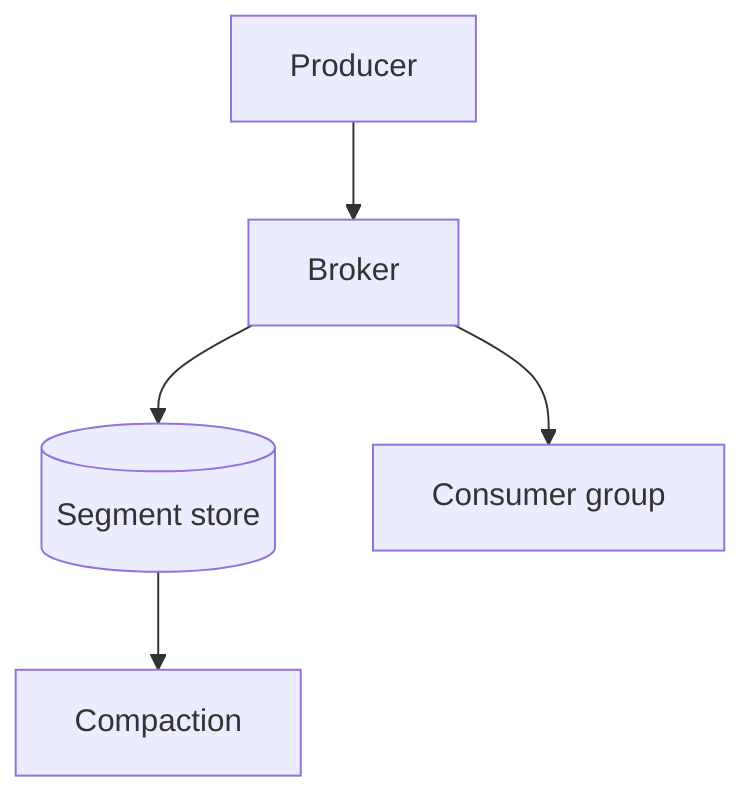

# Aurora 3.0

Aurora is a **streaming ingest layer** with *predictable* tail latency.
Full docs live at [the handbook](https://example.com/handbook).

> [!NOTE]
> This release changes the default compression codec.

> [!WARNING]
> `zstd` level 19 will saturate a single core. Cap it at 9 in production.

## Highlights

- Zero-copy record framing
- Backpressure that ~~drops~~ *parks* the producer
- Per-topic retention policy

### Benchmarks

| Codec  | Throughput | p99 latency | Ratio |
|:-------|-----------:|------------:|:-----:|
| none   |  1.9 GB/s  |      0.4 ms |  1.0x |
| lz4    |  1.4 GB/s  |      0.7 ms |  2.1x |
| zstd-3 |  0.9 GB/s  |      1.2 ms |  3.4x |
| zstd-9 |  0.3 GB/s  |      4.8 ms |  4.1x |

### Configuration

```toml
[ingest]
codec = "zstd"
level = 9
parked_producer_timeout_ms = 250
```

```rust
pub fn frame(buf: &[u8]) -> Result<Frame<'_>> {
    let (hdr, rest) = buf.split_at(HEADER_LEN);
    Ok(Frame { hdr: Header::parse(hdr)?, body: rest })
}
```

## Architecture



## Migration

> Upgrade the brokers before the clients. The wire format is
> backward compatible, not forward compatible.

1. Drain the consumer group
2. Roll the brokers
3. Re-enable the group

> [!TIP]
> `aurora doctor --pre-upgrade` checks all three in one pass.
